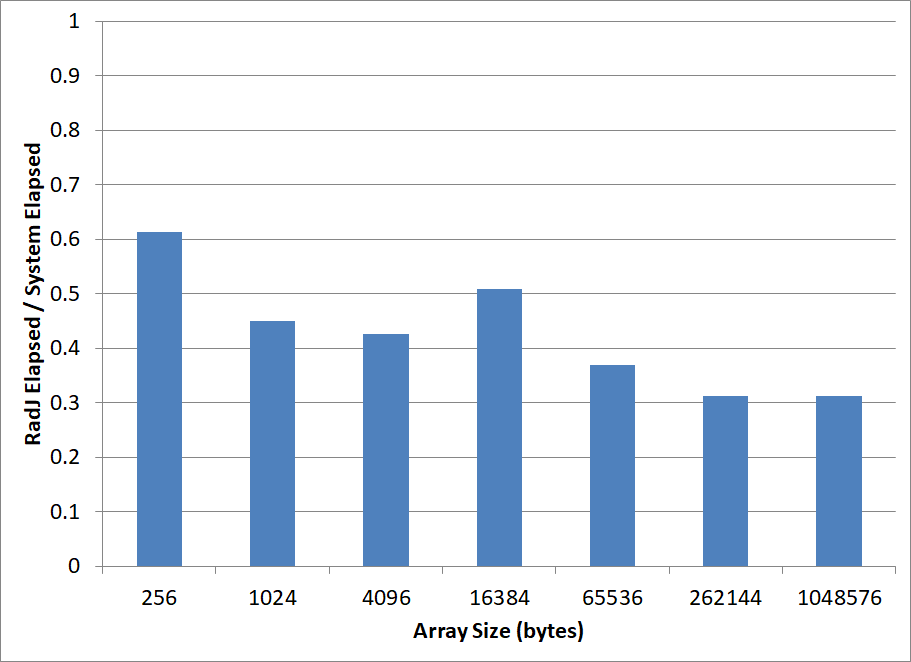

# East Castle Sorting

## Overview

The East Castle Sorting library has two objectives:
1. Provide an improved Java sorting interface.
2. Provide an improved Java sorting implementation. 

### Improving Java's Sorting Interface

Java currently provides sorting functionality for arrays and lists via static methods in the <code>Arrays</code> and <code>Collections</code> classes respectively. This sorting functionality is mature and provides support for a variety of types, but it suffers from the following shortcomings:
1. The implementation is hardwired to the interface. That is, any given call to <code>Arrays.sort()</code> or <code>Collections.sort()</code> is hardwired to one - and only one - implementation.
If an application wishes to be able to switch sort implementations on the fly (say using serial sort in one environment, and parallel sort in another), it will need to implement custom logic to call the appropriate methods.
2. Sorting functionality is spread between two classes - <code>Arrays</code> and <code>Collections</code> - each presenting a slightly different interface. 
This structure complicates separating the interface from the implementation.
3. Sorting in reverse order is not supported. Applications wishing to sort in reverse order must first sort in forward order, and then reverse the sorted elements manually.


East Castle Sorting addresses each of these concerns by separating the sorting interface from the implementation, and providing a consistent, consolidated interface that supports sorting in reverse order. 
This separation allows East Castle to introduce the ability to select the implementation at runtime.
In addition, East Castle's interface provides support for index-based sorting (so-called "linear sorting"), which can outperform comparison sorting in many instances.

See http://www.glennjudd.com/EastCastle/doc/javadoc/ for the javadoc of the API.

### Improving Java's Sorting Implementation

The separation of interface from implementation introduces the ability to provide multiple sorting implementations - each tailored to a specific requirement. East Castle provides access to the existing Java system sorts via a serial and a parallel implementation. In addition, East Castle provides an index-based sorting implementation that is linear in asymptotic complexity, and outperforms the existing Java system sorts in many instances. 

## Using East Castle Sorting

East Castle sorting can be accessed statically via the Sorts class:
```
   int[] a = new int[] {5, 0, -7, 1};

   Sorts.sort(a);
```
This will use a default sorting implementation based on the type of data being sorted.

See [usage](doc/Usage.md) for additional examples.

See http://www.glennjudd.com/EastCastle/doc/javadoc/ for the javadoc of the API.

## RadJ

RadJ is East Castle's hybrid index-based sorting implementation. RadJ uses a combination of MSB-radix sorting, LSB-radix prefix sorting, merge sorting, and the underlying system sorts (e.g. for small sorts).

### RadJ Implementation

While RadJ is a work in progress, its implementation presently outperforms Java's system sorts in many cases. Most RadJ development effort has been spent on optimizing cases where index-based sorting outperforms Java's sytem sorts (i.e. largely random data). In these cases, RadJ significantly outperforms Java's existing system sorts. In addition, RadJ exploits the case where the range of data being sorted is less than the full range of the type in use (e.g. only 32 bits of a 64-bit long are actually used).

For example, the following chart compares the elapsed time required to sort randomly populated long arrays of various sizes using RadJ versus the time required using Java's system sorts. For each bar, the height is obtained by dividing the elapsed RadJ sort time by the elapsed System sort time (i.e. < 1 implies that RadJ sort was faster, > 1 that the System sort was faster.)



For cases where merging is more appropriate, RadJ employs a merge sort. Currently, RadJ's merge sort is usually slower than the default system sort when a low number of "natural runs" occur (and a low number of merges need to take place). For cases where large numbers of "natural runs" occur, RadJ usually outperforms Java's system sorts.

See [this document](doc/Performance.md) for a full discussion of performance.