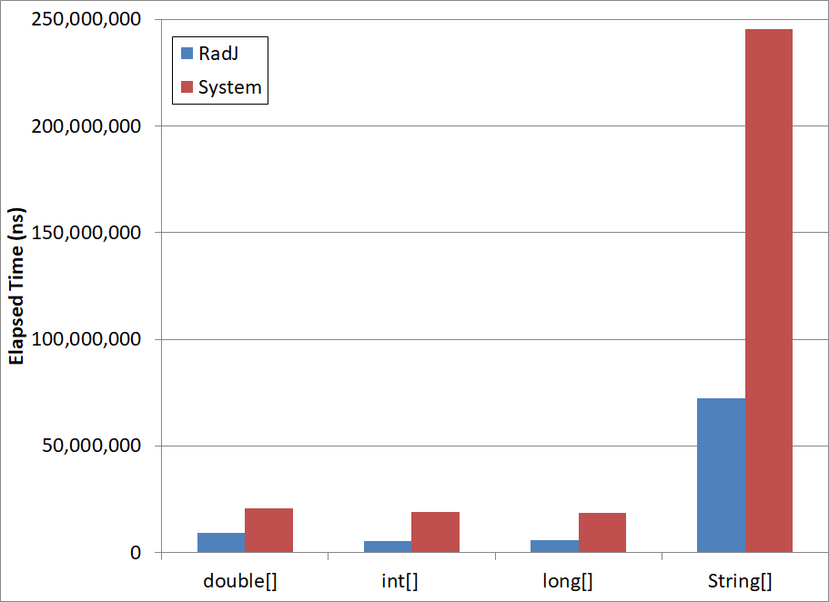
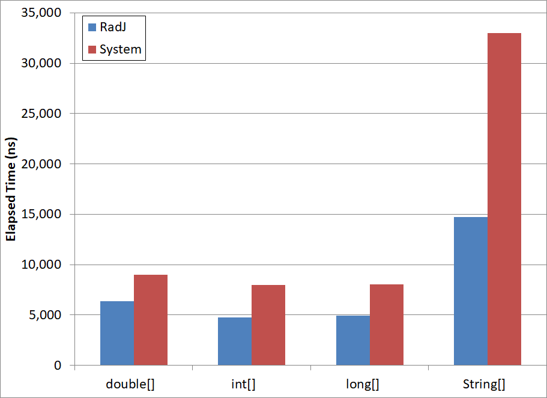
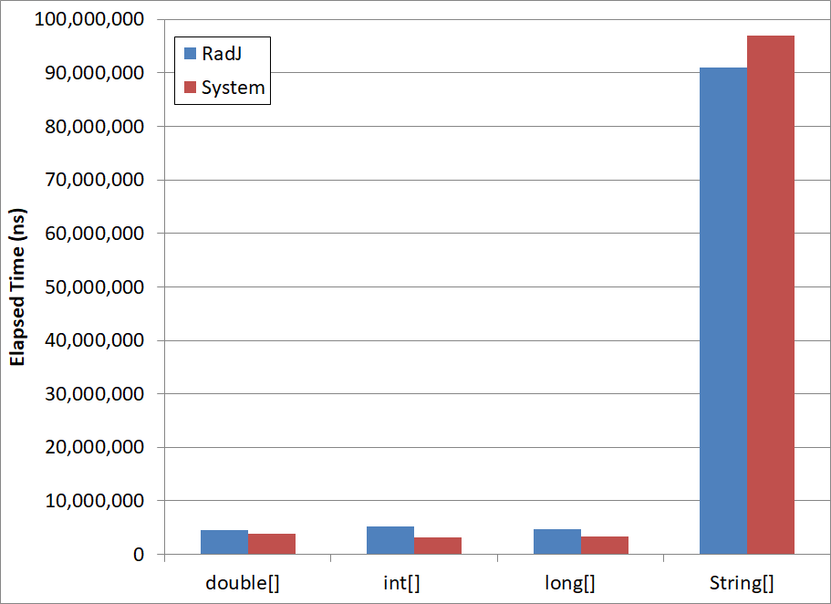
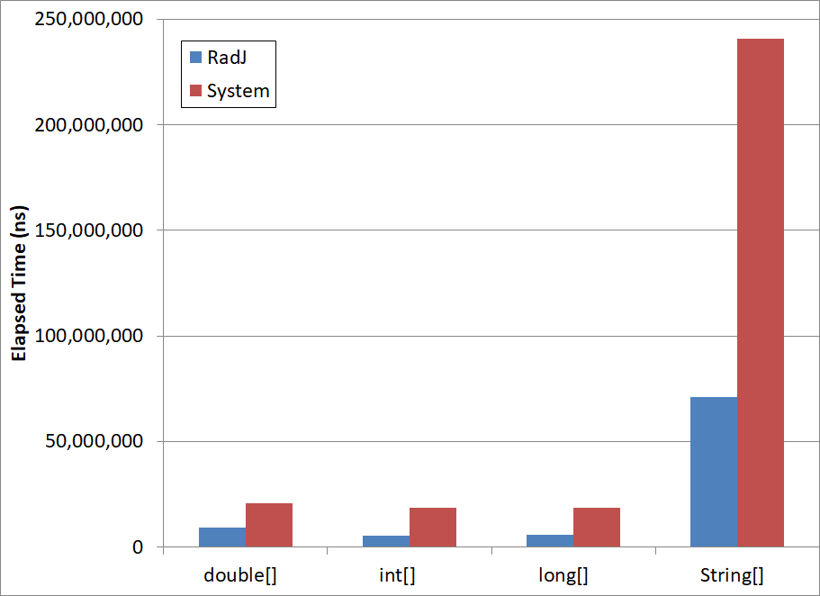
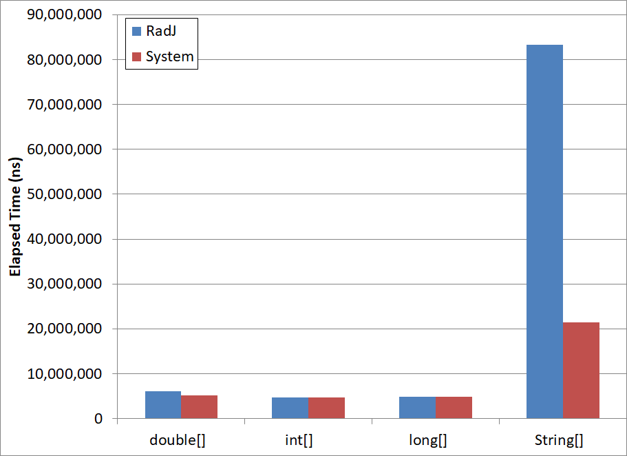
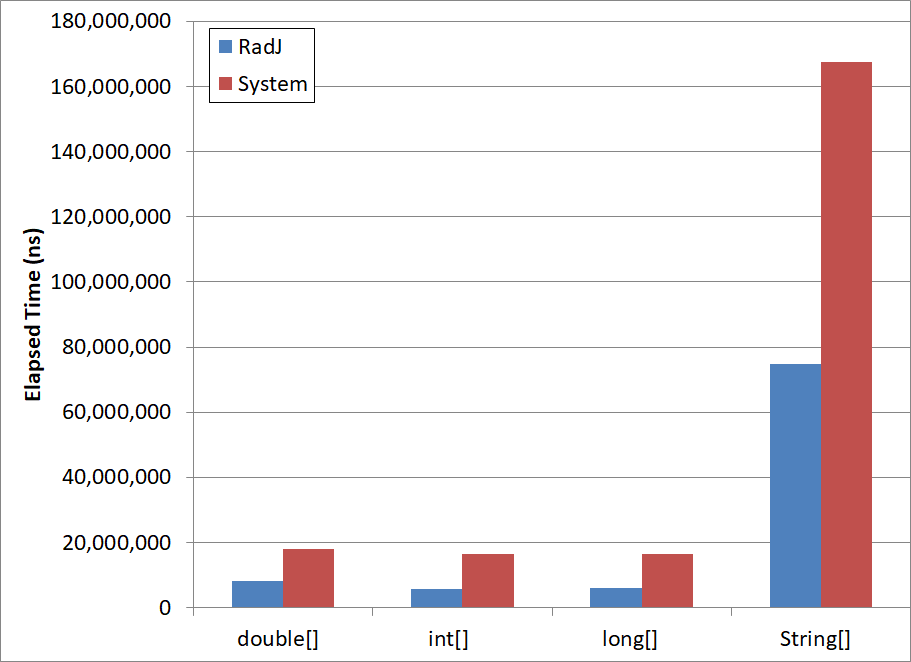

# East Castle Sorting Performance

## RadJ Performance

This document compares RadJ's performance with Java's built in system sorts when sorting source data derived from distinct distributions - selected to exercise both strengths and weaknesses of RadJ. We present data for the following types: <code>int[]</code>, <code>long[]</code>, <code>double[]</code>, <code>String[]</code>. (Sorting lists is supported, but performance is not shown here as list sorting uses array sorting internally—thus performing similarly.)

Each runtime shown below was the average of 20 runs of an internal benchmarking application. Each run of the application was itself the average of a large number of runs measured after a warmup period.
Measures of spread are omitted for simplicity, but the runtimes are generally very consistent—the standard deviation is typically less than 1.5% of the average.

The results shown below are from tests run on AWS t4g.small instances. Tests were also run on t3.small instances. As the t3.small results were roughly similar, they are omitted for the sake of brevity.

(Full instructions on precisely reproducing these results is an open work item, but obtaining roughly similar results is straightforward.)

### Random

The random distribution tests sort elements of random data. First, we show compare sorting performance for a single type - <code>long</code> - for several different array sizes.
Specifically, the below chart compares the elapsed time required to sort randomly populated long arrays of various sizes using RadJ versus the time required using Java's system sorts. For each bar, the height is obtained by dividing the elapsed RadJ sort time by the elapsed System sort time (i.e. < 1 implies that RadJ sort was faster, > 1 that the System sort was faster.)
For data that is distributed randomly, RadJ often outperforms Java's system sorts by a significant factor.

The following charts now compare RadJ sorting time to System sorting time for a fixed array size, across several data types.
In these tests, for <code>int[]</code> and <code>long[]</code>, each element is drawn from a uniform distribution ranging across all possible values. For <code>double[]</code>, the values are the same as used for <code>long[]</code>, but converted to doubles (each element is created by first drawing a random long, and then that value is converted to a double). For <code>String[]</code>, the strings sorted are 16 bytes in length, and each character is drawn from a uniform distribution ['a', 'z'].

The below chart shows RadJ and System sorting time (in nanoseconds) for arrays with 261,144 elements for various data types. 
RadJ significantly outperforms Java's system sorts for the cases tested here.

A 256 element test (below) shows similar results.

### Four Runs

The four run distribution tests first generate a random array (as above), then divide that array into four regions, sorting each region independently. This regionally-sorted array is then used as the source array for sorting.

For this test, RadJ's radix sorting offers no benefit as the elements in the source array can be totally sorted by simply performing a few merges. RadJ recognizes this, and uses merge sorting for this case. RadJ's merging, however, is presently often somewhat slower than Java's system sorting. Reducing this difference is future work.

### Runs of Length Eight

The runs of length eight test generates data using the same method as the other run tests. Instead of a fixed number of runs of varying length, however, this test uses a variable number of runs of fixed length - eight elements - in the source array. In this case, radix sorting often significantly outperforms Java's sytem sorts.

### 128 Swapped Elements

The 128 swapped elements test first sorts the entire source array, and then randomly swaps 128 pairs of elements (with replacement). In this case, RadJ takes significantly longer than System sorting for Strings, slightly longer for doubles, and nearly the same time for ints and longs.
This is an example of a case where East Castle's flexibility in selecting the underlying implementation could be used. 
If this case were suspected to be common, East Castle sorting could be configured to prefer system sorting for Strings, while retaining RadJ for other cases.

### Partially Sorted

The partially sorted test first fills the source array with random data, and then sorts a range of data comprising half of the elements. 
That is, the source array consists of one-half sorted elements and one-half random elements.
RadJ often significantly outperforms System sorting for this case.

